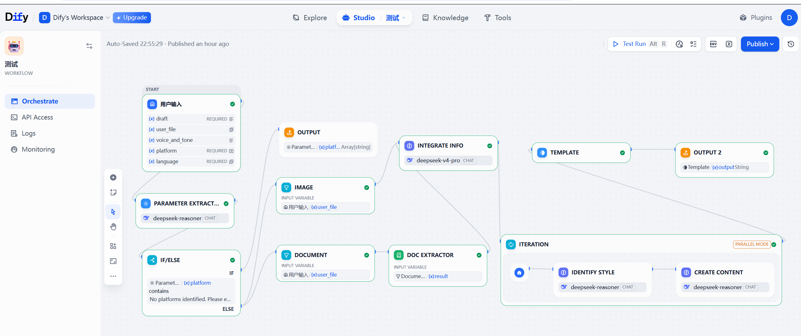
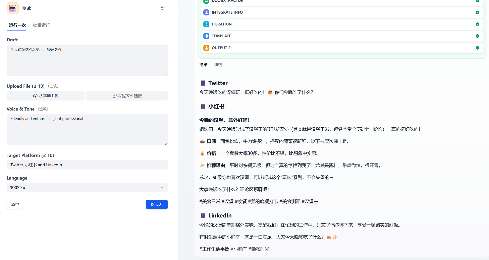

最近我在学 [Dify](https://dify.ai/zh)。总体来说还挺简单的，就是翻译做的有点问题，直接看英文版有点累，下面是我画的demo

发布之后看上去还不错


一开始只是想搞清楚它是什么：一个 AI 应用开发平台，可以把 LLM、Prompt、RAG、工具调用、Workflow、Chatflow、API 发布这些东西用可视化方式串起来。对非专业开发者来说，它确实很友好。你不用先写一套后端服务，也不用从零搭 Agent 框架，拖几个节点，填几个 Prompt，就能做出一个能跑的 AI 应用。

但越看我越有一个感觉：现在的 Dify，真的是我们想要的 Dify 吗？

## 从一个模板问题开始

我最开始踩到的是一个很小的问题：在 Dify 的 Template 节点里写 Jinja 模板。

比如输入是这样的：

```json
{
  "output": [
    {
      "platform_name": "Twitter",
      "post_content": "我们刚刚发布了一款新的AI写作助手，帮助团队将内容创作速度提升10倍！"
    },
    {
      "platform_name": "LinkedIn",
      "post_content": "我们刚刚推出了一款全新的AI写作助手！"
    }
  ]
}
```

模板里想这么循环：

```jinja2

# {{ item.platform_name }}
{{ item.post_content }}


```

但问题往往不在语法本身，而在 Dify 节点之间变量传递的形状：`output` 到底是数组，还是一个包含 `output` 字段的对象？如果是后者，循环就要写成 `output.output`。再进一步，如果上游 LLM 返回的是一段 JSON 字符串，而不是结构化数组，模板节点也会出问题。

这个小问题其实挺典型。Dify 把很多复杂东西包装进了可视化节点，但当你真的开始做应用，还是绕不开数据结构、变量作用域、节点输入输出和类型约束。

## Dify 解决了什么

Dify 的价值很明确。

它把 AI 应用里的很多常见工程问题做成了产品能力：模型接入、知识库、工作流编排、工具调用、日志、发布、API、插件。对团队内部原型、运营工具、知识库问答、客服 Bot、内容生成流来说，它确实能明显降低上手门槛。

它也是开源生态里热度很高的项目。和它类似的还有 [Langflow](https://github.com/langflow-ai/langflow)、[Flowise](https://github.com/FlowiseAI/Flowise)、[RAGFlow](https://github.com/infiniflow/ragflow)、[n8n](https://github.com/n8n-io/n8n)、[Coze Studio](https://github.com/coze-dev/coze-studio) 等。不同项目侧重点不一样：Dify 更像 AI 应用平台，Langflow 和 Flowise 更偏可视化 Agent/RAG 编排，RAGFlow 更偏文档解析和 RAG，n8n 更偏自动化集成。

从国内 AI 应用岗、Agent 开发岗的 JD 来看，Dify 也确实有学习价值。很多偏应用开发的岗位不是在招纯算法研究，而是在招能把 LLM、RAG、Agent、工具调用、业务系统和工程部署串起来的人。Dify、LangChain、LangGraph、LlamaIndex、RAGFlow、FastAPI、MCP、Function Calling、向量数据库、Docker，这些词会反复出现。

所以我不觉得 Dify 没用。相反，它很适合作为 AI 应用开发的入门入口，也适合做团队里的原型和中后台 AI 工具。

但问题是：它现在的形态，可能还不是最终形态。

## 可视化工作流的老问题

Dify 现在的交互，本质上还是传统低代码那套思路：人来拖节点，人来连线，人来配置参数。

这让我想到 UML，也想到 Scratch。

它们看上去都很美好：可视化、直观、门槛低。但只要工程稍微复杂一点，画布很容易变乱。节点越来越多，线越来越多，分支越来越多，最后你面对的不是清晰的系统结构，而是一张越来越难维护的流程图。

这不是 Dify 独有的问题，而是很多可视化编排工具的共同问题。

可视化适合表达结构，但不一定适合创造结构。尤其在 AI 应用里，真正难的不是把几个节点摆上去，而是搞清楚输入输出、状态、异常分支、工具契约、重试策略、评估方式和可维护性。

如果这些东西还是靠人一点点拖出来，那就很像用老低代码思路做新 AI 产品。

## AI 都能写复杂代码了，为什么还要人手动画流程图？

这是我最关心的问题。

现在 AI 已经可以写代码、改代码、读文档、生成测试、解释架构。那为什么一个类 UML 的工作流，还要靠人手动画？

更合理的方式应该是：


也就是说，画布不应该是第一入口。自然语言才应该是第一入口。

用户说：“帮我做一个客服工单自动分类和回复工作流，有高风险问题先转人工，普通问题查知识库再回复。”

系统应该直接生成工作流。

用户继续说：“加一个企业微信通知节点”，“高优先级工单要写入数据库”，“回答前先检查是否命中知识库”。这些修改也应该通过自然语言完成。

最后，系统再把这个结构落成 Dify DSL、LangGraph 代码、n8n workflow，或者某种更通用的中间表示。

## Dify DSL 让这件事变得可行

Dify 支持 DSL 导入导出，这其实给了我们一个很好的切入点。

根据 [Dify 的 App Management 文档](https://docs.dify.ai/en/use-dify/workspace/app-management)，Dify 应用可以导出成 DSL，里面包括 App 配置、Workflow 编排、节点设置、模型参数和 Prompt 模板。根据 [Dify Key Concepts](https://docs.dify.ai/en/use-dify/getting-started/key-concepts)，所有 Dify App 都可以导出为 YAML 格式的 Dify DSL，也可以直接从这些 DSL 文件创建应用。

这意味着 Dify 的 Workflow 不只是画布上的图，而是一份可以生成、校验、版本管理和迁移的配置。

如果 AI 能稳定生成 Dify DSL，那么就可以绕过手动画布这一步：


社区里已经有人在做类似方向。比如 Dify GitHub Discussion 里有一个 [Workflow Skill](https://github.com/langgenius/dify/discussions/34916)，目标就是从自然语言生成可导入的 Dify workflow DSL。还有一个叫 [workflow-skill](https://github.com/LingyiChen-AI/workflow-skill) 的项目，支持一句话生成 Coze、Dify、ComfyUI 的工作流定义文件，其中 Dify 部分会生成 `.dify.yml` 或 `.dify.json`，再通过 UI 的 Import DSL 导入。

这说明问题不是能不能做，而是能不能做得稳定、可维护、足够贴近真实工程。

## 但我想要的不只是“生成后导入”

到这里，我还是觉得不够。

“生成 DSL → 导入 Dify → 画布显示”当然比手动拖节点舒服，但它仍然偏传统。它只是把手动拖拽变成了 AI 生成配置，本质上仍然围绕 Dify 的画布系统转。

我更想试的是另一种体验：

用户始终用自然语言和系统对话，系统实时维护一个工作流结构。可视化画布只是结果的投影，不是主要编辑入口。

也就是说：

- 自然语言负责创造和修改
- 结构化 DSL 负责确定性表达
- 可视化负责检查和理解
- 代码或平台配置负责执行

这样才更像 AI 时代的工作流构建方式。

传统低代码强调“不会写代码的人也能拖出系统”。但 AI 时代也许应该换个问题：如果 AI 已经能生成代码和配置，为什么人还要亲自拖？

## 可能的实现路径

我想要的东西大概会分成几层。

第一层是自然语言入口。用户只描述目标，不直接操作节点。

第二层是中间表示。系统先生成一个平台无关的 workflow IR，比如：

```yaml
name: customer_ticket_reply
inputs:
  - name: ticket_content
    type: text
steps:
  - id: classify
    type: llm_classify
    input: ticket_content
  - id: risk_route
    type: if_else
    condition: classify.risk_level == "high"
  - id: search_kb
    type: knowledge_retrieval
  - id: reply
    type: llm_generate
outputs:
  - reply.text
```

第三层才是平台适配器。它可以把这个 IR 编译成 Dify DSL，也可以编译成 LangGraph 代码、n8n workflow，或者直接变成 FastAPI 后端里的 Python 逻辑。

第四层是可视化。画布根据 IR 渲染出来，用户可以看、可以点、可以局部修改，但不必把拖拽当成主要生产方式。

第五层是校验和测试。比如检查变量是否存在、节点是否有输入输出、分支是否闭合、工具参数是否匹配、是否有异常路径、是否有可运行的示例输入。

真正难的不是画一个图，而是让这个图能跑、能改、能解释、能测试。

## 先挖个坑

所以我打算后面自己写一个类似的小东西。

目标很简单：一句话生成工作流，然后可以继续用自然语言修改，最后再看怎么可视化、怎么导出、怎么导入 Dify。

第一版不追求大而全，可能只支持几个核心节点：

- Start
- LLM
- Tool
- HTTP
- If-Else
- Template
- End

重点不是节点数量，而是验证这种交互方式是否真的更舒服。

如果它能比现在手动画 Dify workflow 更自然，那说明问题就不在 Dify 本身，而在入口方式。

现在的 Dify 已经有价值。

但我想要的 Dify，可能不是一个让我更方便拖节点的平台，而是一个我说清楚目标之后，它能自己长出工作流，再让我用自然语言继续修正的系统。
